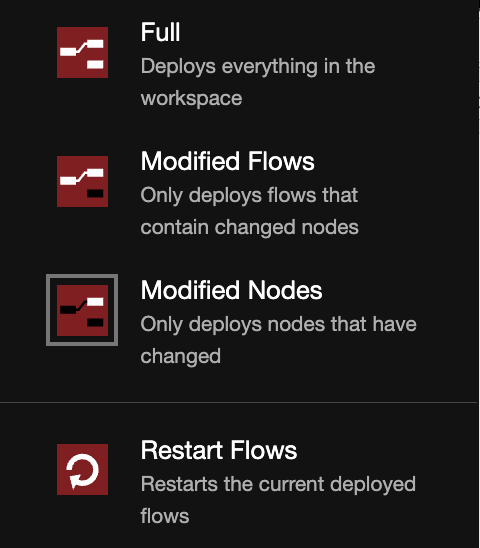

# Dev Info

## TODO:
 - restrict permissions for ray dashboard
 - check for name and route collisions
 - fault tolerance:
    - add checks to see that Ray is running before deploying the application
    - node status should check the actual application status, not just that it was successfully uploaded
    - redeploy after failure
    - retry loop for requests
 - preserve message ordering?
 - better way of showing logs?
 - Why do you have to use a double slash with ray? `http://ray:8000//hello-world`
 - Preserve non-nodered deployed Ray Serve apps

For testing message rates during redeploys, you should use "Deploy: Modified nodes" mode so that your interval nodes will continue publishing at a different rate. Otherwise any variations that you see could be attributed to interval resets.
