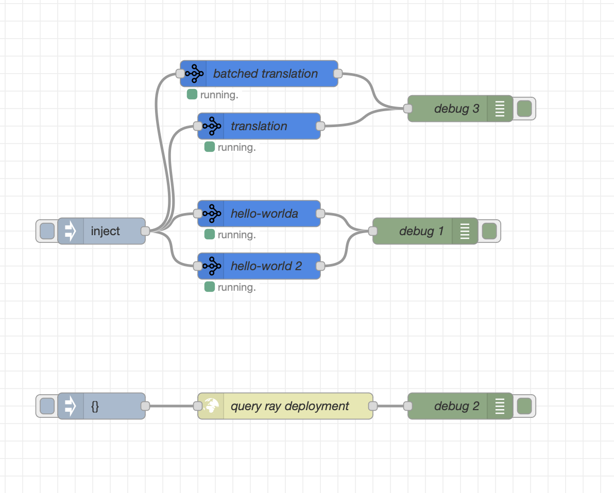
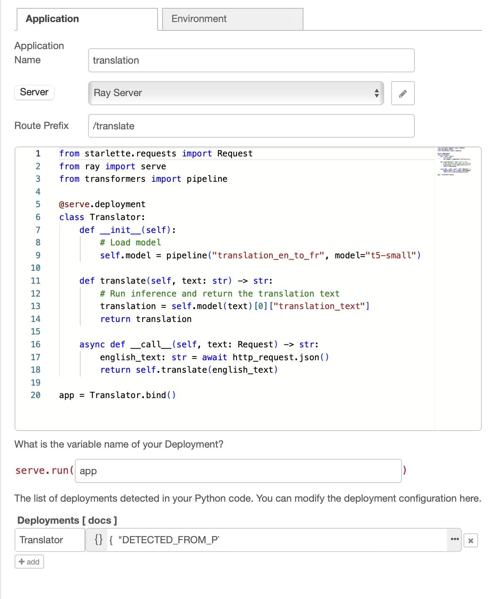
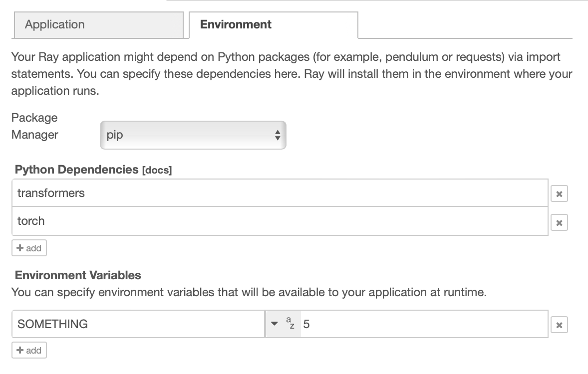
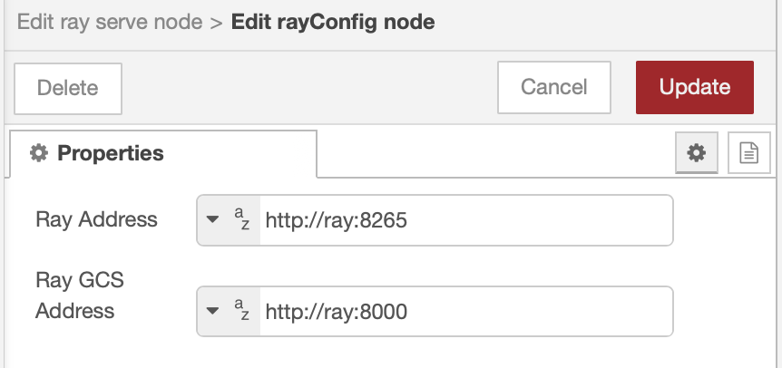
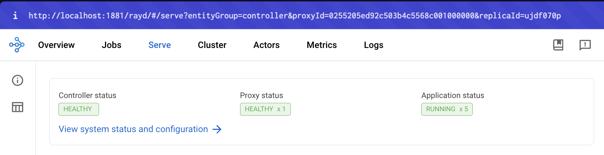

# Deploy Ray Serve Applications with NodeRed.

> IMPORTANT: This will overwrite existing apps deployed to Ray Serve

## Demo

```
docker-compose up -d --build
```

[nodered here](http://localhost:1881)

Deploy functions to Ray Serve directly from NodeRed.



Configure your python functions



Add python dependencies and environment variables



Manage central Ray config



Can potentially access the dashboard (by proxying) but I can't get it to require permissions so it's currently disabled.



TODO:
 - ray dashboard permissions
 - fault tolerance:
    - add checks to see that Ray is running before deploying the application
    - node status should check the actual application status, not just that it was successfully uploaded
    - redeploy after failure
 - better way of showing logs?
 - Why do you have to use a double slash with ray? `http://ray:8000//hello-world`

You can query available routes:
```bash
http://ray:8000//-/routes
```

## Example flow
```json
[{"id":"1b282ad2a8f263c6","type":"tab","label":"Flow 1","disabled":false,"info":"","env":[]},{"id":"4aa8c146e14b5457","type":"inject","z":"1b282ad2a8f263c6","name":"","props":[{"p":"payload"}],"repeat":"","crontab":"","once":false,"onceDelay":0.1,"topic":"","payload":"hello! How are you today?","payloadType":"str","x":130,"y":400,"wires":[["0ac04ebf60711eea","71d33ea259873f69","f296ec25d329b1f4","3dd4cc4be799ba10"]]},{"id":"8a353f104266b6b7","type":"debug","z":"1b282ad2a8f263c6","name":"debug 1","active":true,"tosidebar":true,"console":false,"tostatus":false,"complete":"payload","targetType":"msg","statusVal":"","statusType":"auto","x":500,"y":400,"wires":[]},{"id":"0ac04ebf60711eea","type":"ray serve","z":"1b282ad2a8f263c6","server":"67985cdbc834cbb3","name":"hello-worlda","route_prefix":"/hello-world","variable_name":"app","package_manager":"pip","dependencies":[],"env_vars":[],"code":"from ray import serve\n\n@serve.deployment\nclass HelloWorld:\n    async def __init__(self):\n        pass\n    async def __call__(self, http_request) -> str:\n        msg: dict = await http_request.json()\n        return {\"payload\": \"Hello from ray!\", \"received\": msg}\n                \napp = HelloWorld.bind()\nserve.run(app)","deployments":[{"name":"HelloWorld"}],"x":310,"y":380,"wires":[["8a353f104266b6b7"]]},{"id":"71d33ea259873f69","type":"ray serve","z":"1b282ad2a8f263c6","server":"67985cdbc834cbb3","name":"hello-world 2","route_prefix":"/asdf","variable_name":"app","package_manager":"pip","dependencies":[],"env_vars":[],"code":"from ray import serve\n\n@serve.deployment\nclass HelloWorld2:\n    async def __call__(self, http_request) -> str:\n        msg: dict = await http_request.json()\n        return {\"payload\": \"Hello from ray 2!\", \"received\": msg}\n                \napp = HelloWorld2.bind()","deployments":[{"0":"{","1":"}","name":"HelloWorld2","DETECTED_FROM_PYTHON":{}}],"deploymentArgs":{"HelloWorld2":{"0":"{","1":"}"}},"x":310,"y":440,"wires":[["8a353f104266b6b7"]]},{"id":"304b2fc1ecd56de4","type":"http request","z":"1b282ad2a8f263c6","name":"query ray deployment","method":"GET","ret":"txt","paytoqs":"body","url":"http://ray:8000//asdf","tls":"","persist":false,"proxy":"","insecureHTTPParser":false,"authType":"","senderr":false,"headers":[],"x":340,"y":600,"wires":[["4a28b7320d2cf247"]]},{"id":"65cc7d67882dff25","type":"inject","z":"1b282ad2a8f263c6","name":"","props":[{"p":"payload"},{"p":"topic","vt":"str"}],"repeat":"","crontab":"","once":false,"onceDelay":0.1,"topic":"","payload":"{}","payloadType":"json","x":130,"y":600,"wires":[["304b2fc1ecd56de4"]]},{"id":"4a28b7320d2cf247","type":"debug","z":"1b282ad2a8f263c6","name":"debug 2","active":true,"tosidebar":true,"console":false,"tostatus":false,"complete":"false","statusVal":"","statusType":"auto","x":540,"y":600,"wires":[]},{"id":"f296ec25d329b1f4","type":"ray serve","z":"1b282ad2a8f263c6","server":"67985cdbc834cbb3","name":"translation","route_prefix":"/translate","variable_name":"app","package_manager":"pip","dependencies":[{"name":"transformers"},{"name":"torch"}],"env_vars":[],"code":"from starlette.requests import Request\nfrom ray import serve\nfrom transformers import pipeline\n\n@serve.deployment\nclass Translator:\n    def __init__(self):\n        # Load model\n        self.model = pipeline(\"translation_en_to_fr\", model=\"t5-small\")\n\n    def translate(self, text: str) -> str:\n        # Run inference and return the translation text\n        translation = self.model(text)[0][\"translation_text\"]\n        return translation\n\n    async def __call__(self, http_request: Request) -> str:\n        english_text: str = await http_request.json()\n        return self.translate(english_text)\n         \napp = Translator.bind()","deployments":[{"name":"Translator","DETECTED_FROM_PYTHON":{}}],"deploymentArgs":{"HelloWorld":{},"Translator34":{"something":5,"DETECTED_FROM_PYTHON":{"num_replicas":3}},"Translator":{"DETECTED_FROM_PYTHON":{}}},"x":310,"y":280,"wires":[["fdd77c7ad943a72f"]]},{"id":"fdd77c7ad943a72f","type":"debug","z":"1b282ad2a8f263c6","name":"debug 3","active":true,"tosidebar":true,"console":false,"tostatus":false,"complete":"false","statusVal":"","statusType":"auto","x":540,"y":260,"wires":[]},{"id":"3dd4cc4be799ba10","type":"ray serve","z":"1b282ad2a8f263c6","server":"67985cdbc834cbb3","name":"batched translation","route_prefix":"/batched_translate","variable_name":"app","package_manager":"pip","dependencies":[{"name":"transformers"},{"name":"torch"}],"env_vars":[],"code":"import asyncio\nfrom starlette.requests import Request\nfrom ray import serve\nfrom transformers import pipeline\n\n@serve.deployment\nclass BatchedTranslator:\n    def __init__(self):\n        # Load model\n        self.model = pipeline(\"translation_en_to_es\", model=\"t5-small\")\n\n    def translate(self, text) -> str:\n        # Run inference and return the translation text\n        translation = [t[\"translation_text\"] for t in self.model(text)]\n        return translation\n\n    @serve.batch(max_batch_size=8, batch_wait_timeout_s=0.1)\n    async def __call__(self, requests) -> str:\n        text: str = await asyncio.gather(*(r.json() for r in requests))\n        return self.translate(text)\n                \napp = BatchedTranslator.bind()","deployments":[{"name":"BatchedTranslator","DETECTED_FROM_PYTHON":{}}],"deploymentArgs":{"HelloWorld":{},"Translator34":{"something":5,"DETECTED_FROM_PYTHON":{"num_replicas":3}},"Translator":{"DETECTED_FROM_PYTHON":{}},"BatchedTranslator":{"DETECTED_FROM_PYTHON":{}}},"x":310,"y":220,"wires":[["fdd77c7ad943a72f"]]},{"id":"67985cdbc834cbb3","type":"rayConfig","rayAddress":"http://ray:8265","rayAddressType":"str","serveAddress":"http://ray:8000","serveAddressType":"str"}]
```