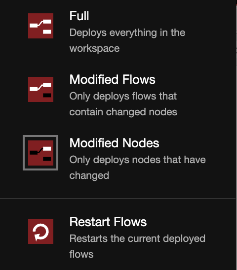

# Deploy Ray Serve Applications with NodeRed.

> This is a prototype - I look forward to hearing feedback and ideas for improvements

Ray is a powerful distributed computing framework for Python that allows you to easily scale your applications. By pairing Ray with Node-RED, you can take advantage of Ray's distributed capabilities to handle large workloads and parallelize tasks, while leaving Node-RED to do what it does best - IO and lightweight data plumbing.

Docs:
 * [Ray.io](https://www.ray.io/): Effortless distributed computing with Python
 * [Ray Serve Docs](https://docs.ray.io/en/latest/serve/index.html): Run Ray with HTTP endpoints
 * [Ray Serve Examples](https://docs.ray.io/en/latest/serve/examples.html): Examples of deploying ML Inference to Ray Serve

## Install

```
docker-compose up -d --build
```

## Screenshots

You can access the Node-Red dashboard [here](http://localhost:1881). The Ray dashboard can be found [here](http://localhost:8265).

Deploy python functions to Ray Serve directly from NodeRed.


Configure your python functions


Add python dependencies and environment variables


Manage Ray servers


Can potentially access the dashboard (by proxying) but I can't get it to require permissions so it's currently disabled.


> NOTE: This will overwrite existing apps deployed to Ray Serve. Could be fixed with [#42974](https://github.com/ray-project/ray/issues/42974)

You can query available routes:
```bash
http://ray:8000//-/routes
```

## Examples
> Speed of running ML model on CPU: replicas >> batching > vanilla

Vanilla english-to-french translator
```python
from ray import serve
from transformers import pipeline

@serve.deployment
class Translator:
    def __init__(self):
        self.model = pipeline("translation_en_to_fr", model="t5-small")

    def translate(self, text: str) -> str:
        return self.model(text)[0]["translation_text"]

    async def __call__(self, http_request) -> str:
        english_text: str = await http_request.json()
        return self.translate(english_text)
         
app = Translator.bind()
```

Using batched inference (up to 8 requests at a time)
```python
import asyncio
from ray import serve
from transformers import pipeline

@serve.deployment
class Translator:
    def __init__(self):
        self.model = pipeline("translation_en_to_fr", model="t5-small")

    def translate(self, text) -> str:
        return [t["translation_text"] for t in self.model(text)]

    @serve.batch(max_batch_size=8, batch_wait_timeout_s=0.1)
    async def __call__(self, requests) -> str:
        text: str = await asyncio.gather(*(r.json() for r in requests))
        return self.translate(text)
                
app = Translator.bind()
```

Using multiple replicas
```python
from ray import serve
from transformers import pipeline

@serve.deployment(num_replicas=3)
class Translator:
    def __init__(self):
        self.model = pipeline("translation_en_to_fr", model="t5-small")

    def translate(self, text: str) -> str:
        return self.model(text)[0]["translation_text"]

    async def __call__(self, http_request) -> str:
        english_text: str = await http_request.json()
        return self.translate(english_text)
         
app = Translator.bind()
```


## How it Works

This module offers two nodes:

 * Ray Serve node - a node to store a Ray Serve Application
    * Ray Config node (which is basically just a wrapper to store the Ray Dashboard URL and Ray Serve URLs)

When the flow is deployed, this module will gather all of the Ray Serve applications and for each Server, it will
 * Create zip files of the code for each application and upload them to Ray's GCS storage
    * Repeat uploads will be skipped based on a hash of its content
 * create a Serve [application payload](https://docs.ray.io/en/latest/serve/api/index.html#serve-rest-api)
 * Deploy the applications by doing `PUT /api/serve/applications`
    * > **Serve Docs**: The endpoint declaratively deploys a list of Serve applications. If Serve is already running on the Ray cluster, removes all applications not listed in the new config. If Serve is not running on the Ray cluster, starts Serve. See [multi-app config schema](https://docs.ray.io/en/latest/serve/api/index.html#serve-rest-api-config-schema) for the request’s JSON schema.

When messages come in, they are sent to the deployed Ray Serve HTTP endpoint. 

The nice thing about this is you can keep the Ray Serve endpoints private to your cluster and Node-RED can access them
from the private network. 


## TODO:
 - restrict permissions for ray dashboard
 - check for name and route collisions
 - fault tolerance:
    - add checks to see that Ray is running before deploying the application
    - node status should check the actual application status, not just that it was successfully uploaded
    - redeploy after failure
    - retry loop for requests
 - preserve message ordering?
 - better way of showing logs?
 - Why do you have to use a double slash with ray? `http://ray:8000//hello-world`
 - Preserve non-nodered deployed Ray Serve apps

For testing message rates during redeploys, you should use "Deploy: Modified nodes" mode so that your interval nodes will continue publishing at a different rate. Otherwise any variations that you see could be attributed to interval resets.


## Example flow
```json
[{"id":"1b282ad2a8f263c6","type":"tab","label":"Flow 1","disabled":false,"info":"","env":[]},{"id":"4aa8c146e14b5457","type":"inject","z":"1b282ad2a8f263c6","name":"","props":[{"p":"payload"}],"repeat":"","crontab":"","once":false,"onceDelay":0.1,"topic":"","payload":"hello! How are you today?","payloadType":"str","x":90,"y":420,"wires":[["fab2d147bd24ee29"]]},{"id":"8a353f104266b6b7","type":"debug","z":"1b282ad2a8f263c6","name":"debug 1","active":true,"tosidebar":true,"console":false,"tostatus":false,"complete":"payload","targetType":"msg","statusVal":"","statusType":"auto","x":660,"y":400,"wires":[]},{"id":"0ac04ebf60711eea","type":"ray serve","z":"1b282ad2a8f263c6","server":"67985cdbc834cbb3","name":"hello-worlda","route_prefix":"/hello-world","variable_name":"app","package_manager":"pip","dependencies":[],"env_vars":[],"code":"from ray import serve\n\n@serve.deployment\nclass HelloWorld:\n    async def __init__(self):\n        pass\n    async def __call__(self, http_request) -> str:\n        msg: dict = await http_request.json()\n        return {\"payload\": \"Hello from ray!\", \"received\": msg}\n                \napp = HelloWorld.bind()\nserve.run(app)","deployments":[{"name":"HelloWorld","DETECTED_FROM_PYTHON":{}}],"deploymentArgs":{"HelloWorld":{"DETECTED_FROM_PYTHON":{}}},"x":470,"y":380,"wires":[["8a353f104266b6b7"]]},{"id":"71d33ea259873f69","type":"ray serve","z":"1b282ad2a8f263c6","server":"67985cdbc834cbb3","name":"hello-world 2","route_prefix":"/asdf","variable_name":"app","package_manager":"pip","dependencies":[],"env_vars":[],"code":"from ray import serve\n\n@serve.deployment\nclass HelloWorld2:\n    async def __call__(self, http_request) -> str:\n        msg: dict = await http_request.json()\n        return {\"payload\": \"Hello from ray 2!\", \"received\": msg}\n                \napp = HelloWorld2.bind()","deployments":[{"0":"{","1":"}","name":"HelloWorld2","DETECTED_FROM_PYTHON":{}}],"deploymentArgs":{"HelloWorld2":{"0":"{","1":"}","DETECTED_FROM_PYTHON":{}}},"x":470,"y":440,"wires":[["8a353f104266b6b7"]]},{"id":"304b2fc1ecd56de4","type":"http request","z":"1b282ad2a8f263c6","name":"query ray deployment","method":"GET","ret":"txt","paytoqs":"body","url":"http://ray:8000//asdf","tls":"","persist":false,"proxy":"","insecureHTTPParser":false,"authType":"","senderr":false,"headers":[],"x":340,"y":600,"wires":[["4a28b7320d2cf247"]]},{"id":"65cc7d67882dff25","type":"inject","z":"1b282ad2a8f263c6","name":"","props":[{"p":"payload"},{"p":"topic","vt":"str"}],"repeat":"","crontab":"","once":false,"onceDelay":0.1,"topic":"","payload":"{}","payloadType":"json","x":130,"y":600,"wires":[["304b2fc1ecd56de4"]]},{"id":"4a28b7320d2cf247","type":"debug","z":"1b282ad2a8f263c6","name":"debug 2","active":true,"tosidebar":true,"console":false,"tostatus":false,"complete":"false","statusVal":"","statusType":"auto","x":540,"y":600,"wires":[]},{"id":"f296ec25d329b1f4","type":"ray serve","z":"1b282ad2a8f263c6","server":"67985cdbc834cbb3","name":"translation","route_prefix":"/translate","variable_name":"app","package_manager":"pip","dependencies":[{"name":"transformers"},{"name":"torch"}],"env_vars":[],"code":"from starlette.requests import Request\nfrom ray import serve\nfrom transformers import pipeline\n\n@serve.deployment\nclass Translator:\n    def __init__(self):\n        # Load model\n        self.model = pipeline(\"translation_en_to_fr\", model=\"t5-small\")\n\n    def translate(self, text: str) -> str:\n        # Run inference and return the translation text\n        translation = self.model(text)[0][\"translation_text\"]\n        return translation\n\n    async def __call__(self, http_request: Request) -> str:\n        english_text: str = await http_request.json()\n        return self.translate(english_text)\n         \napp = Translator.bind()","deployments":[{"name":"Translator","DETECTED_FROM_PYTHON":{}}],"deploymentArgs":{"HelloWorld":{},"Translator34":{"something":5,"DETECTED_FROM_PYTHON":{"num_replicas":3}},"Translator":{"DETECTED_FROM_PYTHON":{}}},"x":470,"y":280,"wires":[["fdd77c7ad943a72f"]]},{"id":"fdd77c7ad943a72f","type":"debug","z":"1b282ad2a8f263c6","name":"debug 3","active":true,"tosidebar":true,"console":false,"tostatus":false,"complete":"false","statusVal":"","statusType":"auto","x":700,"y":260,"wires":[]},{"id":"3dd4cc4be799ba10","type":"ray serve","z":"1b282ad2a8f263c6","server":"67985cdbc834cbb3","name":"batched translation","route_prefix":"/batched_translate","variable_name":"app","package_manager":"pip","dependencies":[{"name":"transformers"},{"name":"torch"}],"env_vars":[],"code":"import asyncio\nfrom starlette.requests import Request\nfrom ray import serve\nfrom transformers import pipeline\n\n@serve.deployment\nclass BatchedTranslator:\n    def __init__(self):\n        # Load model\n        self.model = pipeline(\"translation_en_to_fr\", model=\"t5-small\")\n\n    def translate(self, text) -> str:\n        # Run inference and return the translation text\n        translation = [t[\"translation_text\"] for t in self.model(text)]\n        return translation\n\n    @serve.batch(max_batch_size=8, batch_wait_timeout_s=0.1)\n    async def __call__(self, requests) -> str:\n        text: str = await asyncio.gather(*(r.json() for r in requests))\n        return self.translate(text)\n                \napp = BatchedTranslator.bind()","deployments":[{"name":"BatchedTranslator","DETECTED_FROM_PYTHON":{}}],"deploymentArgs":{"HelloWorld":{},"Translator34":{"something":5,"DETECTED_FROM_PYTHON":{"num_replicas":3}},"Translator":{"DETECTED_FROM_PYTHON":{}},"BatchedTranslator":{"DETECTED_FROM_PYTHON":{}}},"x":470,"y":220,"wires":[["fdd77c7ad943a72f"]]},{"id":"2bd11c464750ae60","type":"inject","z":"1b282ad2a8f263c6","name":"","props":[{"p":"payload"},{"p":"topic","vt":"str"}],"repeat":"","crontab":"","once":false,"onceDelay":0.1,"topic":"","payload":"{}","payloadType":"json","x":130,"y":540,"wires":[["52cd0ec8808ab2d7"]]},{"id":"52cd0ec8808ab2d7","type":"http request","z":"1b282ad2a8f263c6","name":"query ray deployment","method":"GET","ret":"txt","paytoqs":"body","url":"http://ray:8000//hello-world","tls":"","persist":false,"proxy":"","insecureHTTPParser":false,"authType":"","senderr":false,"headers":[],"x":340,"y":540,"wires":[["9b98464332e6fa0b"]]},{"id":"9b98464332e6fa0b","type":"debug","z":"1b282ad2a8f263c6","name":"debug 4","active":true,"tosidebar":true,"console":false,"tostatus":false,"complete":"false","statusVal":"","statusType":"auto","x":540,"y":540,"wires":[]},{"id":"03e0fef603eb1235","type":"inject","z":"1b282ad2a8f263c6","name":"","props":[{"p":"payload"},{"p":"topic","vt":"str"}],"repeat":"","crontab":"","once":false,"onceDelay":0.1,"topic":"","payload":"{}","payloadType":"json","x":130,"y":660,"wires":[["ffb7cf6a4151efae"]]},{"id":"ffb7cf6a4151efae","type":"http request","z":"1b282ad2a8f263c6","name":"query ray deployment","method":"GET","ret":"txt","paytoqs":"body","url":"http://ray:8000//-/routes","tls":"","persist":false,"proxy":"","insecureHTTPParser":false,"authType":"","senderr":false,"headers":[],"x":340,"y":660,"wires":[["e7489e5f80477c88"]]},{"id":"e7489e5f80477c88","type":"debug","z":"1b282ad2a8f263c6","name":"debug 5","active":true,"tosidebar":true,"console":false,"tostatus":false,"complete":"false","statusVal":"","statusType":"auto","x":540,"y":660,"wires":[]},{"id":"2ef41ea6e4554760","type":"ray serve","z":"1b282ad2a8f263c6","server":"67985cdbc834cbb3","name":"translation replicas","route_prefix":"/translate-replicas","variable_name":"app","package_manager":"pip","dependencies":[{"name":"transformers"},{"name":"torch"}],"env_vars":[],"code":"from starlette.requests import Request\nfrom ray import serve\nfrom transformers import pipeline\n\n@serve.deployment(num_replicas=3)\nclass TranslatorReplicas:\n    def __init__(self):\n        # Load model\n        self.model = pipeline(\"translation_en_to_fr\", model=\"t5-small\")\n\n    def translate(self, text: str) -> str:\n        # Run inference and return the translation text\n        translation = self.model(text)[0][\"translation_text\"]\n        return translation\n\n    async def __call__(self, http_request: Request) -> str:\n        english_text: str = await http_request.json()\n        return \"asdfasdf \" + self.translate(english_text)\n         \napp = TranslatorReplicas.bind()","deployments":[{"name":"TranslatorReplicas","DETECTED_FROM_PYTHON":{"num_replicas":3}}],"deploymentArgs":{"HelloWorld":{},"Translator34":{"something":5,"DETECTED_FROM_PYTHON":{"num_replicas":3}},"Translator":{"DETECTED_FROM_PYTHON":{"num_replicas":3}},"TranslatorReplicas":{"DETECTED_FROM_PYTHON":{"num_replicas":3}}},"x":470,"y":160,"wires":[["fdd77c7ad943a72f"]]},{"id":"dc7375473b416612","type":"function","z":"1b282ad2a8f263c6","name":"","func":"\nreturn msg;","outputs":1,"timeout":0,"noerr":0,"initialize":"","finalize":"","libs":[],"x":325,"y":220,"wires":[["f296ec25d329b1f4","3dd4cc4be799ba10","2ef41ea6e4554760"]],"icon":"node-red/cog.svg","l":false},{"id":"0e1151c76dc10b6b","type":"function","z":"1b282ad2a8f263c6","name":"","func":"\nreturn msg;","outputs":1,"timeout":0,"noerr":0,"initialize":"","finalize":"","libs":[],"x":355,"y":420,"wires":[["71d33ea259873f69","0ac04ebf60711eea"]],"icon":"node-red/cog.svg","l":false},{"id":"fab2d147bd24ee29","type":"function","z":"1b282ad2a8f263c6","name":"","func":"\nreturn msg;","outputs":1,"timeout":0,"noerr":0,"initialize":"","finalize":"","libs":[],"x":275,"y":340,"wires":[["dc7375473b416612","0e1151c76dc10b6b"]],"icon":"node-red/cog.svg","l":false},{"id":"f052829ab83e1841","type":"inject","z":"1b282ad2a8f263c6","name":"","props":[{"p":"payload"}],"repeat":"","crontab":"","once":false,"onceDelay":0.1,"topic":"","payload":"May I take your hat, sir?","payloadType":"str","x":170,"y":220,"wires":[["dc7375473b416612"]]},{"id":"67985cdbc834cbb3","type":"rayConfig","rayAddress":"http://ray:8265","rayAddressType":"str","serveAddress":"http://ray:8000","serveAddressType":"str"}]
```
